<h1 align="center">Hi 👋, I'm Mahafuzul Haque</h1>
<h3 align="center">Senior Shopify Theme Developer · 5+ years shipping production stores</h3>

<em>I fix Shopify themes that broke — carts, variant selectors, theme updates, app conflicts.</em>

---

### 🐛 What I Fix

Most of my work starts with a merchant saying "it was working yesterday."

- 🛒 Cart drawer not updating quantity or totals
- 🎨 Variant selectors and colour swatches that stopped switching
- 🔄 Theme updates that wiped previously working custom code
- ⚔️ App conflicts — two scripts fighting over the same element
- 🚨 Console errors on product and collection templates
- 📱 Layouts breaking on mobile but fine on desktop
- 💧 Liquid rendering the wrong data, or nothing at all

I work on a duplicate theme, never your live store. Flat rate quoted before I start, and the first 15 minutes of diagnosis is free.

📧 **[mahafuzulhaq99@gmail.com](mailto:mahafuzulhaq99@gmail.com)** · 💬 **[WhatsApp](https://wa.me/8801784020530)** · 💼 **[LinkedIn](https://www.linkedin.com/in/mh-forhad-773a37323/)**

---

### ⚡ How I Work

**Vanilla first.** I reach for what Shopify already gives me before I build something custom, because every dependency is a thing that breaks during the next theme update. Most of what I write is Liquid, plain JavaScript, and Web Components.

**Documented.** I write down what I changed and why. The next developer who opens your theme shouldn't have to guess.

---

### 💼 Also Available

- 🔄 **Platform migration to Shopify** — WooCommerce, Magento, BigCommerce, custom builds
- 📥 **Data import and cleanup** — products, customers, orders, with integrity checks
- 🎨 **Custom theme and section development** — Dawn-based, built to your design spec
- ⚡ **Speed and Core Web Vitals passes** — audit, fixes, before and after scores
- 🛍️ **Shopify app development** — smaller projects while I build depth here

---

<!-- ============================================================
     RECENT FIXES — hidden until filled in.
     Delete these two comment lines to publish the section.

### 🔧 Recent Fixes

**[Cart drawer showing stale quantities]**
Symptom: [what the merchant saw]
Cause: [what was actually wrong]
Fix: [what you changed]
Result: [number if you have one]
→ [link to repo or write-up]

**[Variant images not switching on selection]**
Symptom: [what the merchant saw]
Cause: [what was actually wrong]
Fix: [what you changed]
Result: [number if you have one]
→ [link to repo or write-up]

**[Lighthouse 41 → 89 on mobile]**
Symptom: [what the merchant saw]
Cause: [what was actually wrong]
Fix: [what you changed]
Result: [number if you have one]
→ [link to repo or write-up]

---
     ============================================================ -->

### 🧰 Core Stack

  
  
  
  
  
  
  
  

### 📚 Working With, Not Claiming Mastery Of

  
  
  
  
  

### 🖥️ Environment

  
  
  
  
  

---

### 🎓 Background

Trained in-house rather than in a classroom — five years of production Shopify work at a small agency, learning on real client stores from developers who'd already done it.

Currently studying statistics. It's changing how I read store data: the difference between a real conversion problem and normal variance is usually a sample size question, not a design one.

---

---

### 📫 Let's Connect

  
  
  

